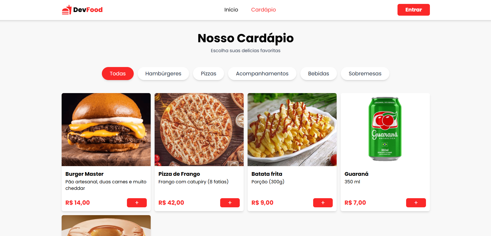
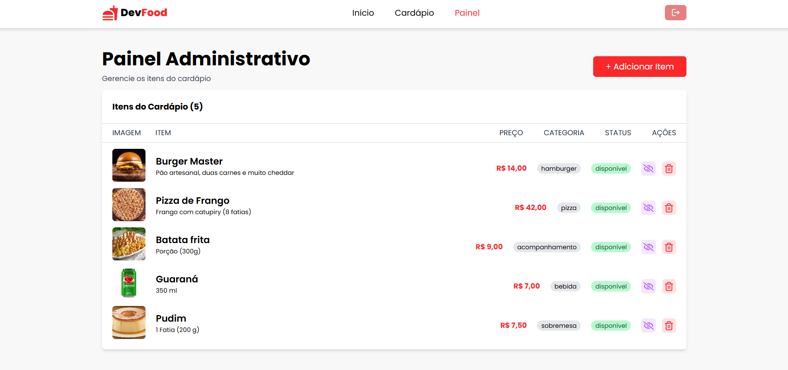
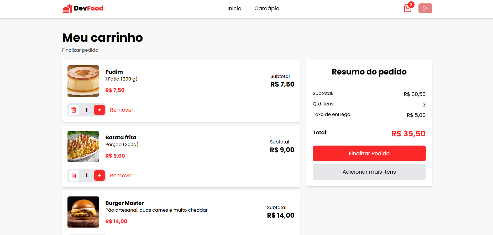

# 📝 Dev Food

E-commerce de Fast Food desenvolvido com React, TypeScript e Firebase, permitindo que clientes realizem pedidos de forma simples e intuitiva, enquanto o administrador gerencia todo o cardápio através de um painel exclusivo.

O projeto foi criado para praticar conceitos de desenvolvimento Front-end moderno, autenticação de usuários, gerenciamento de estado global, persistência de dados e integração com serviços do Firebase.

---

## 🚀 Tecnologias Utilizadas

⚛️ React        
🔷 TypeScript       
⚡ Vite     
🎨 Tailwind CSS     
🔥 Firebase Authentication      
🔥 Firebase Firestore       
🔥 Firebase Storage     
⚛️ Context API      
⚛️ React Router DOM     
⚛️ React Hook Form      
✅ Zod      
🎬 Framer Motion        
✨ AOS (Animate On Scroll)      
🔔 React Toastify      

--- 

## 🏗️ Arquitetura do Projeto

### A aplicação utiliza:

- AuthContext → Gerenciamento da autenticação dos usuários.       
- ProductsContext → Responsável por buscar e disponibilizar os produtos do Firestore.     
- CartContext → Gerenciamento completo do carrinho de compras.        

### Os dados são armazenados utilizando os serviços do Firebase:

- Authentication → Login e cadastro de usuários.      
- Firestore → Armazenamento dos produtos.     
- Storage → Upload e gerenciamento das imagens dos produtos.      

---

## 👤 Funcionalidades do Cliente

✔️ Criar conta e realizar login     
✔️ Navegar pelo cardápio        
✔️ Filtrar produtos por categoria       
✔️ Adicionar produtos ao carrinho       
✔️ Aumentar ou diminuir a quantidade dos itens      
✔️ Remover produtos do carrinho     
✔️ Persistência do carrinho utilizando Local Storage        
✔️ Finalizar pedido através do WhatsApp     
✔️ Feedback visual para todas as ações da aplicação     
✔️ Interface responsiva para desktop e dispositivos móveis

---

## 🛠️ Funcionalidades do Administrador

✔️ Painel administrativo protegido      
✔️ Cadastro de novos produtos       
✔️ Upload de imagens para os produtos   
✔️ Alteração de status dos produtos (Disponível / Indisponível)     
✔️ Exclusão de produtos     
✔️ Modal de confirmação para ações críticas     
✔️ Validação para impedir cadastro de produtos com nomes duplicados   

---

## 🔐 Segurança e Controle de Acesso

### A aplicação possui um sistema de controle de acesso baseado no UID do Firebase Authentication.

#### Administrador:     

- Acesso ao Dashboard     
- Cadastro de produtos        
- Alteração de status     
- Exclusão de produtos        

#### Usuário Comum:

- Acesso ao cardápio      
- Acesso ao carrinho      
- Finalização de pedidos      

### Além da proteção realizada no Front-end, as regras de segurança do Firebase foram configuradas para permitir alterações no banco de dados apenas para o usuário administrador.

## ✅ Validações

Os formulários utilizam React Hook Form + Zod para validação dos dados.

### Validações implementadas:

- Campos obrigatórios     
- Login       
- Cadastro de usuário     
- Cadastro de produtos        
- Categorias válidas      
- Preço válido        
- Verificação de produtos duplicados

--- 

## 🛒 Persistência do Carrinho

O carrinho é armazenado utilizando Local Storage, permitindo que os itens permaneçam salvos mesmo após atualizar a página.

Também foi implementada uma verificação automática para remover produtos do carrinho quando eles se tornam indisponíveis no sistema.

---

## 📸 Preview

---

## 🌎 Deploy

### Acesse o projeto online:

👉 https://devfood-six.vercel.app

---

## 💡 Aprendizados

### Durante o desenvolvimento deste projeto foram praticados conceitos como:

- Autenticação com Firebase
- Firestore e Storage
- Controle de acesso por níveis de usuário
- Criação de Contextos com Context API
- Gerenciamento global de estado
- Validação de formulários com React Hook Form e Zod
- Persistência de dados com Local Storage
- Integração com APIs externas
- Organização e componentização de aplicações React
- Tipagem forte com TypeScript
- Boas práticas de UX/UI
- Animações com Framer Motion e AOS